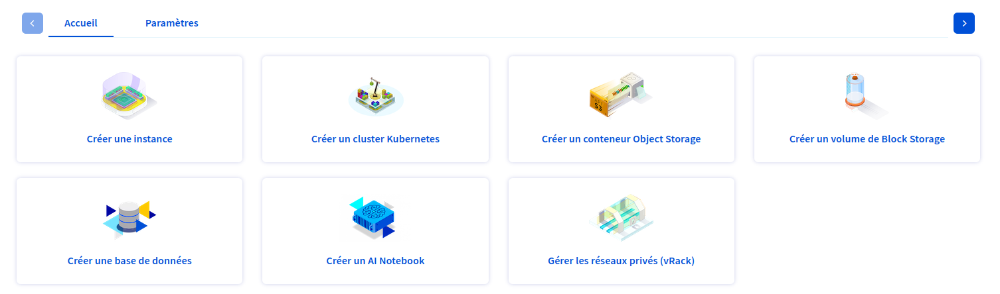

# POC de Ovh k8S x ArgoCD

L'objectif est de déployer une application via ArgoCD sur un cluster k8S Ovh managé.

## Infra

- 1 cluster k8s
- 3 nodes discovery D2-4

## Objectif

- Déployer une application via ArgoCD
- Déployer une stack ingress (HAProxy, CertManager)
- Exposer ArgoCD et l'app via un ingress https

## Bilan

- ArgoCD fonctionne
- L'app est déployée
- L'ingress est fonctionnel
- Les deux applications sont exposées via un ingress https
- Les certificats sont générés par CertManager
- Les certificats sont renouvelés automatiquement
- Les certificats sont bien utilisés par HAProxy

## Marche à suivre

### 0. Prérequis

- Avoir un compte Ovh
- Avoir un compte Ovh Public Cloud
- Creer un projet dans public cloud capable de créer un cluster k8s (ex: avoir une carte bancaire valide)

### 1. Créer un cluster k8s

Une fois dans l'interface Ovh, rendez vous dans la partit "Managed kubernetes service" de la partit ["Public Cloud"](https://www.ovh.com/manager/#/public-cloud/?onboarding) et cliquez sur "Créer un cluster Kubernetes".



Sélectionnez la localisation, le nombre de noeuds et le type de noeuds. Pour ce POC, nous avons choisi :

- Localisation : Gravelines (GRA11)
- Kubernetes version : 1.31
- Réseau privé : Oui - creez un nouveau private network et uttilisez l'ip public pour accéder a internet.
- Type de noeuds : discovery D2-4
- Taille du pool : 3, Autoscaling : Non
- Facturation : Horraire, Anti-Affinité : Non
- Nom du cluster : Weebo-Ovh-4 (A votre convenance)

Une fois les informations renseignées et le cluster créé, vous devriez voir apparaitre un cluster dans la liste des clusters. Une fois qu'il est passer en "Running", vous pouvez passer à l'étape suivante.

### 2. Configurer kubectl

Pour la facilité de la gestion du projet, le fichier Taskfile.yml prend par défault le kubeconfig présent dans le répértoir courrant au nom `kubeconfig.yml`, pour le retrouver celui ci est dans l'interface du cluster, cliquez sur le bouton k8s a droite de l'écran.

### 3. Installer ArgoCD

Pour installer ArgoCD, il suffit de lancer la commande suivante :

```bash
task argo:install
```

Cette commande va creer un namespace `argocd` et installer ArgoCD dans ce namespace a partir du manifeste `argocd-install.yaml`. L'intéret de garder le manifeste est de pouvoir le mettre a jour si besoin.

### 4. Configurer ArgoCD

Pour exposer argocd en local, uttilisez la commande suivante :

```bash
task argo:port-forward
```

cette commande va exposer le service argocd-server en local sur le port 8080. Pour accéder à l'interface, ouvrez votre navigateur et rendez vous sur `http://localhost:8080`.

Pour vous connecter, utilisez le login par défault :

- Username : admin
- Password : le mot de passe est présent dans le secret `argocd-initial-admin-secret` du namespace `argocd`.

Pour le récupérer, utilisez la commande suivante :

```bash
kubectl -n argocd get secret argocd-initial-admin-secret -o jsonpath="{.data.password}" | base64 -d
```

Ensuite, connectez vous avec le login par défault et le mot de passe récupéré sur la CLI:

```bash
argocd login localhost:8080
```

⚠️⚠️⚠️

Il est recommandé de changer le mot de passe par défault après la première connexion. uttilisez la commande suivante :

```bash
argocd account update-password
```

⚠️⚠️⚠️

### 5. Creer l'application main

L'application main situer dans le dossier 'app-main' a pour but de contenir la sources des application a déployer. Pour la déployer, il suffit de lancer la commande suivante :

```bash
task argo:create-main
```

Cette commande va uniquement creer via la ligne de commande argocd l'application main avec pour source le dossier 'app-main'. Ce sous dossier contient une autre application `ingress` qui elle contient `haprox` et `cert-manager`.

Pensez a vérifier dans l'application web que vos projets sont bien présent et mis a jour.

### 6. Exposer l'application

Par défaut, les deux application sont exposé sur un nom de domaine qui ne pointe pas sur l'addresse ip du cluster. Il est recommandé de changer les domaines dans les fichiers ingress:

- 'ingress/argo.yaml'
- demo-guestbook/ingress.yaml <== Cette ingress va couvrir TOUT les point d'entrée (équivalent d'un default bakend)

Pour récupérer l'addresse ip du loadbalancer, utilisez la commande suivante :

```bash
kubectl get svc -n ingress haproxy-ingress -o jsonpath="{.status.loadBalancer.ingress}"
```

L'attribution de l'addresse ip peut prendre quelques minutes due a la création du loadbalancer coté Ovh.

Il y aura possiblement plusieurs addresse ip, choisissez celle qui correspond a votre cluster. (Essayez les une par une, et celle qui affichera une page guestbook est la bonne).

Une fois l'addresse ip récupérée, faite pointer le nom de domaine sur cette addresse ip. Personnellement, j'ai fait pointer un sous domaine wildcard sur la floating ip du loadbalancer.

```bind
*.ovh.weebo.fr 3600 IN A ${FLOATING_IP}
```

### 7. Exposer ArgoCD

Pour exposer ArgoCD, il faut modifier la configmap `argocd-cmd-params-cm` dans le namespace `argocd` en ajoutant `server.insecure: "true"`. une fois fait, redémarrez le pod `argocd-server` pour appliquer les changements.

```bash
kubectl -n argocd rollout restart deployment argocd-server
```

### 8. Accéder aux applications

Pour accéder aux applications, rendez vous sur les domaines que vous avez configuré dans les fichiers ingress.

Enjoy !
